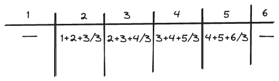
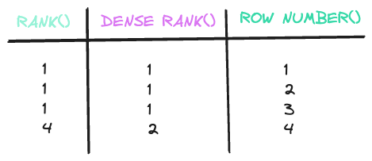

# Important KPIs

#### Rolling AVG(), SUM(), etc.

```SQL
SELECT
AVG(count) OVER (
    PARTITION BY category
    ORDER BY date
    ROWS BETWEEN N PRECEEDING AND CURRENT ROW) 
FROM table;
```
   



#### RANK(), DENSE RANK(), ROW NUMBER()
Is used to calculate and answer lot of different analytical questions: 




#### MODE, MEDIAN, MEAN

The MODE is the most frequent value in the set

The MEDIAN is the middle value of the set

The MEAN is the value ponderate value in the set 
 ```SQL
  SELECT 
    PERCENTILE_CONT(0.5) WITHIN GROUP(ORDER BY metric) AS median
FROM table;
```

### YoY Growth

$ 100\times\frac{Current Year Earnings — Last Year’s Earnings}{Last Year’s Earnings} $

### Notes
- ```FLOOR()``` allows to put float in integers, rounded at the bottom
- ```SALE()``` allows to put float in integers, rounded at the top

- ```<>``` same as ```!=```

### CTR
class 9

### CTP

